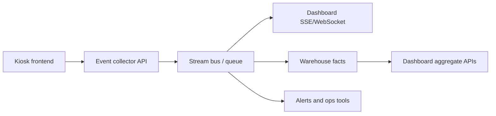

# Real-time data flow for Fynd Kiosk dashboard

The dashboard should not depend on manual refresh. Kiosk events should move continuously from the customer journey into the dashboard and warehouse.

## Target flow



## Runtime behavior

1. Kiosk frontend calls `trackKioskEvent(...)` for every journey event.
2. Event collector receives `POST /analytics/kiosk-events`.
3. Collector validates schema, masks PII, attaches server timestamp, and acknowledges quickly.
4. Collector publishes to a stream bus.
5. Dashboard receives the event immediately over SSE/WebSocket.
6. Warehouse stores the event and joins it with orders, payment, catalog, inventory, and device data.
7. Aggregated APIs feed KPI cards, funnel, tables, and operational alerts.

## Dashboard update model

Use two layers:

- **Live event stream:** low-latency event feed for recent customer activity, warnings, and operational heartbeat.
- **Aggregate refresh:** periodic rollups for KPI cards, revenue, conversion, uptime, payment success, and RAG tables.

Suggested refresh cadence:

| Data | Cadence | Transport |
|---|---:|---|
| Latest events | 1-3 seconds | SSE/WebSocket |
| Device heartbeat | 30-60 seconds | SSE/WebSocket + API |
| Payment status | 5-15 seconds | Webhook + stream |
| OMS pending/SLA | 15-30 seconds | API poll or stream |
| Revenue/KPI aggregates | 1-5 minutes | API summary |
| Catalog/inventory joins | 5-30 minutes | Batch/CDC |

## Event collector contract

Minimum endpoint:

```http
POST /analytics/kiosk-events
Content-Type: application/json
```

Minimum response:

```json
{
  "accepted": true,
  "event_id": "evt_..."
}
```

Live dashboard stream:

```http
GET /analytics/stream
Accept: text/event-stream
```

Summary endpoint:

```http
GET /analytics/summary
```

## Production requirements

- Validate against `boilerplate/kiosk-event-contract.json`.
- Block raw mobile numbers, OTPs, auth tokens, and raw user/order/cart IDs.
- Hash or tokenize user, mobile, cart, and order identifiers before analytics storage.
- Keep raw request logs restricted to engineering.
- Make collector idempotent by `event_id`.
- Add retries with backoff on kiosk frontend.
- Store offline events locally on kiosk if network drops.
- Add dead-letter queue for malformed events.
- Alert on event silence by store/kiosk.

## First production milestones

1. Instrument bootstrap, auth, scan, manual barcode, cart, checkout, payment, and support events.
2. Ship collector API and warehouse table.
3. Add SSE/WebSocket endpoint for latest events.
4. Connect dashboard live stream panel.
5. Keep dashboard cards empty until real aggregate APIs or live events populate them.
